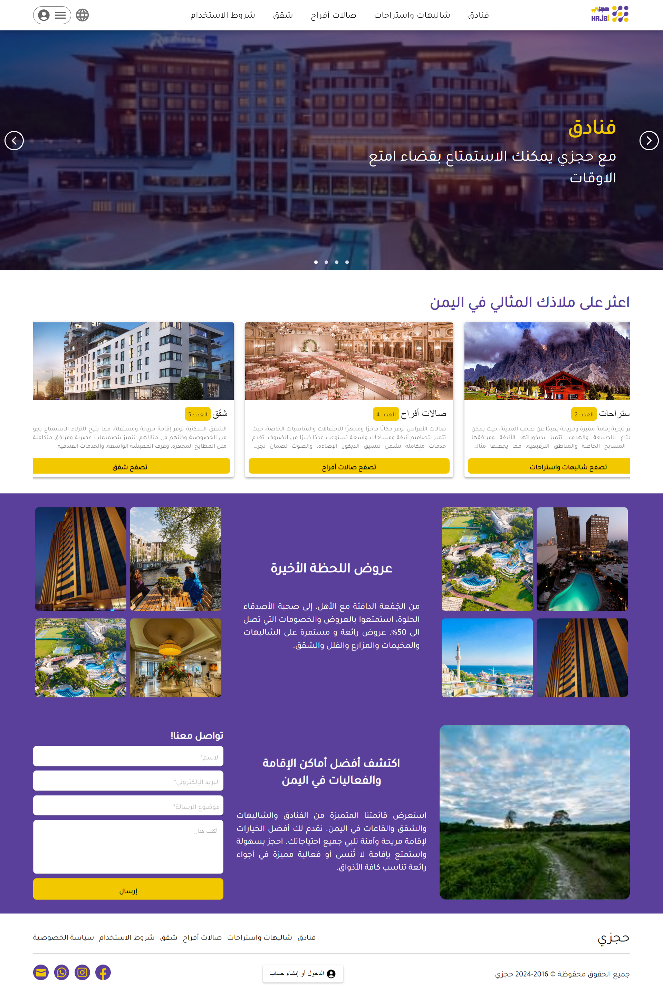
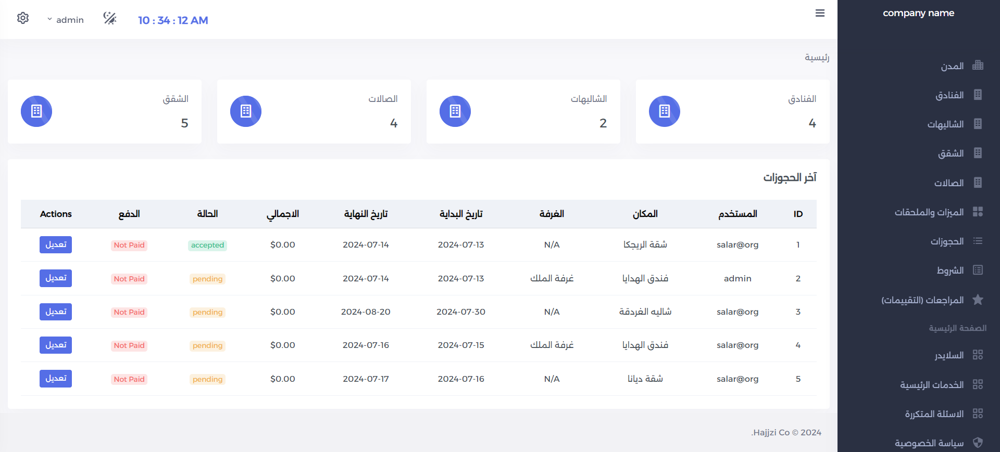
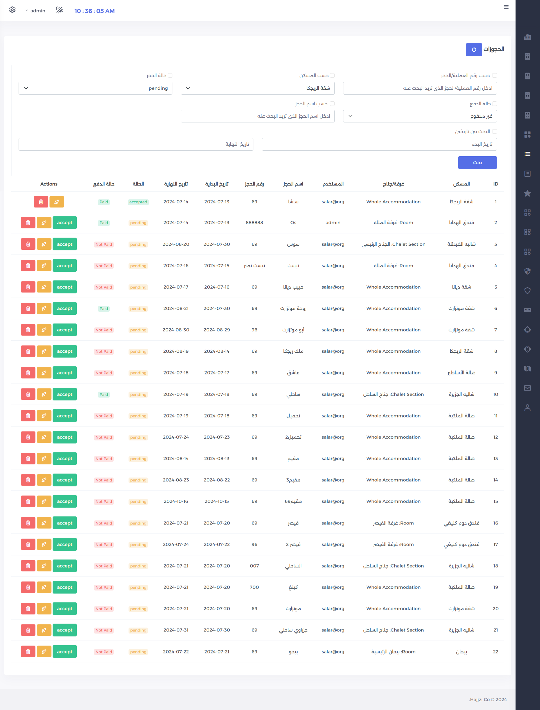
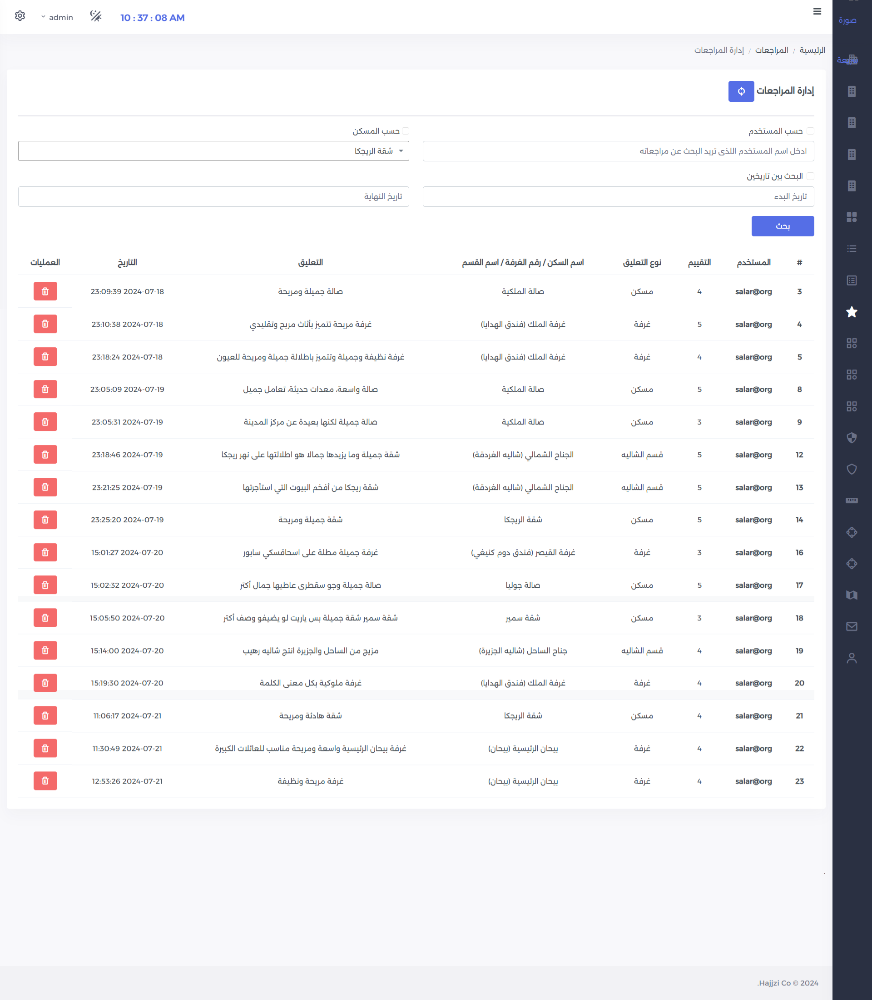

# Online Booking System

A Laravel-based online booking system for reserving hotels, chalets, halls, and apartments. This project allows users to browse detailed listings and make reservations, with an admin dashboard for managing content and listings.

## Features

- User registration and authentication
- Detailed listings for hotels, chalets, halls, and apartments
- Advanced search and filtering options
- Booking management
- Admin dashboard for content and listing control
- Main page content management (CMS)
- User reviews and ratings

## Screenshots






## Installation

1. Clone the repository:
   ```bash
   git clone https://github.com/Roodi7/hajjzi.git
   cd hajjzi
   ```

2. Install dependencies:
   ```bash
   composer install
   npm install
   ```

3. Copy the example environment file and configure your environment variables (you should add your email address setup informations to be able send automatic accpet mails to users):
   ```bash
   cp .env.example .env
   php artisan key:generate
   ```

4. Set up your database in the `.env` file and run migrations:
   ```bash
   php artisan migrate
   php artisan db:seed
   ```
5. It creates admin with the credentials:
    email: test@example.com
    password: admin

6. Serve the application:
   ```bash
   php artisan serve
   ```

7. Compile assets:
   ```bash
   npm run dev
   ```

## Usage

- Register and log in as a user to browse and book accommodations.
- Log in as an admin to manage listings and main page content.